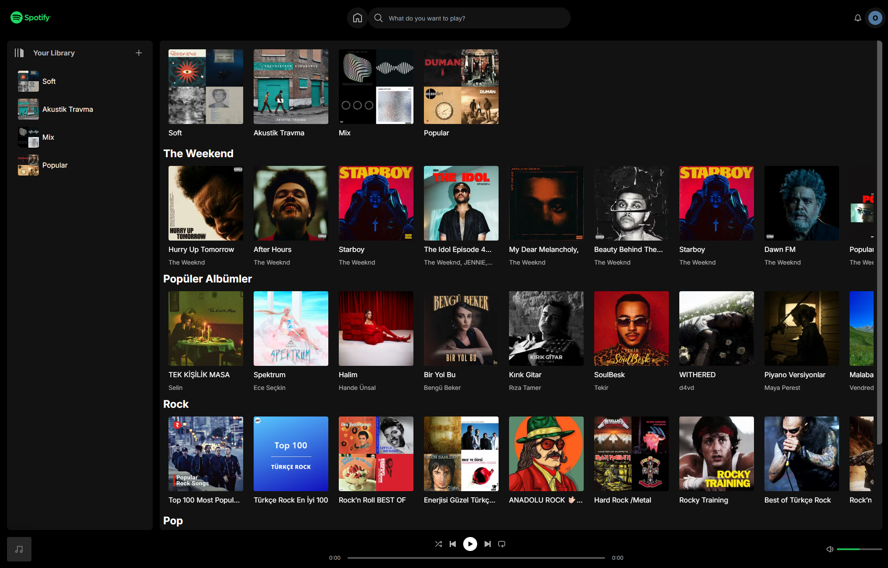
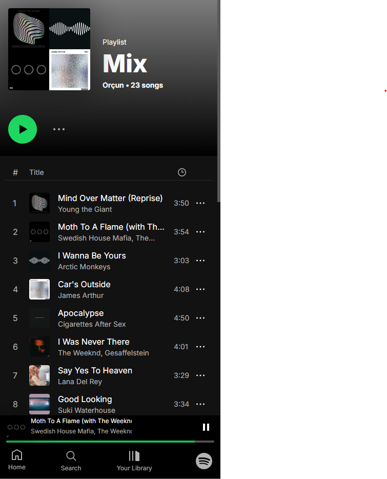

# 🎧 Spotify Clone Application

## 🚀 Live Demo

[https://spotify-clone-with-next-js.vercel.app](https://spotify-clone-with-next-js.vercel.app)

## 🖼 Screenshots

### 🖥 Desktop View – Home Page


### 📱 Mobile View – Playlist Page  
<p align="center">
  
</p>

## 🛠️ Technologies Used

- Next.js
- React
- Tailwind CSS
- Spotify Developer API

## ✨ Features

- 🔐 User Authentication
Users can log in with their own Spotify accounts using secure OAuth authentication.

- 🎧 Play Music Directly
Users can play tracks directly from playlists with an embedded Spotify player.

- 📁 View Personal Playlists
Users can view their own saved playlists fetched from the Spotify API.

- ➕ Create New Playlists
Users can create new playlists in their Spotify account directly from the app interface.

- 🔍 Search for Songs, Artists, Albums
Fully functional search feature that allows users to find music content using Spotify’s search endpoint.

- 📚 Browse by Categories
Browse music by genres or categories like Pop, Rock, Chill, Workout, and more.

- 💡 Responsive UI
Optimized for all screen sizes — mobile, tablet, and desktop.

- ⚡ Fast & Seamless User Experience
Built with Next.js for fast page loads and smooth routing.


## 📦 Installation & Setup

To run the project locally:

```bash
git clone https://github.com/orcunakkaya/Spotify-Clone.git
cd Spotify-Clone
npm install
npm run dev```